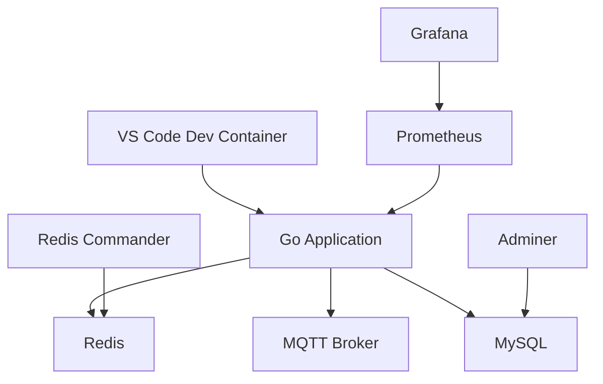

# FANET API Backend Dev Container

Этот Dev Container обеспечивает полную среду разработки для FANET API Backend проекта с предустановленными сервисами и инструментами.

## 🚀 Быстрый старт

1. **Откройте проект в VS Code** с установленным расширением "Dev Containers"
2. **Нажмите `Ctrl+Shift+P`** и выберите "Dev Containers: Reopen in Container"
3. **Дождитесь сборки** контейнера и автоматической настройки
4. **Запустите API**: `make dev`

## 📦 Включенные сервисы

### Основные сервисы
- **Go 1.23** - последняя версия с полным набором инструментов
- **Redis 7** - для кеширования и геопространственных запросов
- **Eclipse Mosquitto** - MQTT брокер для FANET данных
- **MySQL 8.0** - для персистентного хранения
- **Prometheus + Grafana** - мониторинг и метрики

### Инструменты разработки
- **Redis Commander** - веб-интерфейс для Redis (порт 8081)
- **Adminer** - веб-интерфейс для MySQL (порт 8082)
- **Air** - hot reload для Go приложений
- **Protocol Buffers** - компилятор и Go плагины
- **golangci-lint** - линтер для Go кода

## 🌐 Порты и доступ

| Сервис | Порт | URL | Описание |
|--------|------|-----|----------|
| FANET API | 8090 | http://localhost:8090 | Основное API |
| Redis | 6379 | redis://localhost:6379 | Redis сервер |
| Redis Commander | 8081 | http://localhost:8081 | Веб-интерфейс Redis |
| MQTT | 1883 | mqtt://localhost:1883 | MQTT брокер |
| MySQL | 3306 | mysql://localhost:3306 | MySQL сервер |
| Adminer | 8082 | http://localhost:8082 | Веб-интерфейс MySQL |
| Prometheus | 9090 | http://localhost:9090 | Сбор метрик |
| Grafana | 3000 | http://localhost:3000 | Дашборды (admin/admin) |

## 🛠️ Команды разработки

```bash
# Установка зависимостей
make deps

# Запуск API с hot reload
make dev

# Генерация Protobuf
make proto

# Запуск тестов
make test

# MQTT тестирование
make mqtt-test

# Быстрый MQTT тест
make mqtt-test-quick

# Сборка Docker образа
make docker-build
```

## 🔧 VS Code расширения

Автоматически устанавливаются следующие расширения:

### Go разработка
- **golang.go** - основная поддержка Go
- **ms-vscode.vscode-go** - дополнительные Go инструменты

### Protocol Buffers
- **zxh404.vscode-proto3** - подсветка синтаксиса .proto файлов
- **pbkit.vscode-pbkit** - дополнительные Proto инструменты

### Базы данных
- **mtxr.sqltools** - SQL клиент
- **mtxr.sqltools-driver-mysql** - MySQL драйвер
- **cweijan.vscode-redis-client** - Redis клиент

### DevOps
- **ms-azuretools.vscode-docker** - Docker поддержка
- **ms-kubernetes-tools.vscode-kubernetes-tools** - Kubernetes инструменты

### API разработка
- **humao.rest-client** - тестирование REST API
- **42crunch.vscode-openapi** - OpenAPI поддержка

## 🏗️ Архитектура



## 🔍 Отладка

### Подключение к базам данных

**Redis Commander**: http://localhost:8081
- Хост: `redis`
- Порт: `6379`

**Adminer**: http://localhost:8082  
- Сервер: `mysql`
- Пользователь: `root`
- Пароль: `password`
- База: `fanet`

### Проверка MQTT

```bash
# Подписка на все сообщения
mosquitto_sub -h mqtt -t "fb/b/+/f/#" -v

# Публикация тестового сообщения
mosquitto_pub -h mqtt -t "fb/b/test/f/1" -m "test-message"
```

### Логи сервисов

```bash
# Логи всех сервисов
docker-compose -f .devcontainer/docker-compose.yml logs

# Логи конкретного сервиса
docker-compose -f .devcontainer/docker-compose.yml logs redis
docker-compose -f .devcontainer/docker-compose.yml logs mqtt
docker-compose -f .devcontainer/docker-compose.yml logs mysql
```

## 🚨 Решение проблем

### Сервисы не запускаются
```bash
# Перезапуск всех сервисов
docker-compose -f .devcontainer/docker-compose.yml down
docker-compose -f .devcontainer/docker-compose.yml up -d
```

### Go модули не устанавливаются
```bash
# Очистка и переустановка модулей
go clean -modcache
go mod download
go mod tidy
```

### Protobuf не генерируется
```bash
# Ручная генерация
make proto
# или
./scripts/proto-gen.sh
```

## 📚 Дополнительные ресурсы

- **DEVELOPMENT.md** - подробная документация разработчика
- **CLAUDE.md** - инструкции для AI ассистента
- **ai-spec/** - технические спецификации проекта
- **deployments/** - конфигурации для развертывания

## 🔒 Безопасность

- Все пароли по умолчанию предназначены только для разработки
- Не используйте эти настройки в production окружении
- Контейнер запускается от имени пользователя `vscode` (не root)
- Docker socket монтируется для Docker-in-Docker функциональности